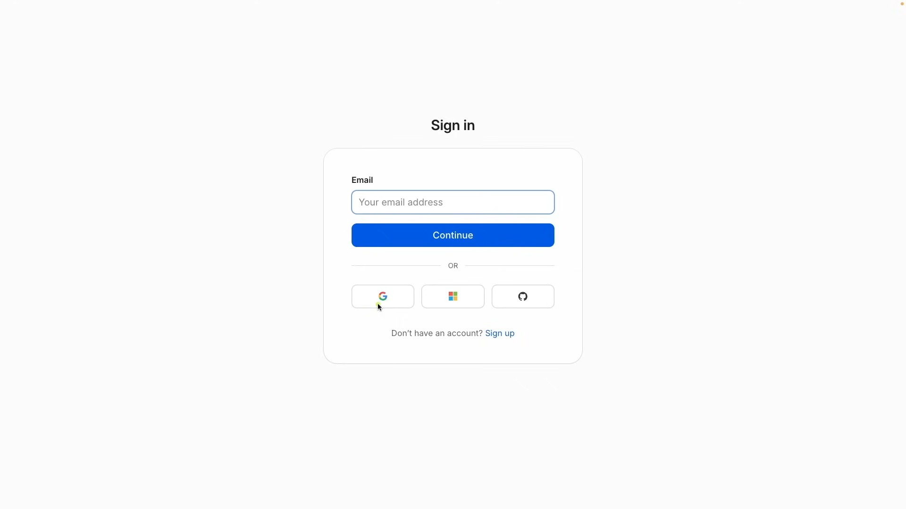
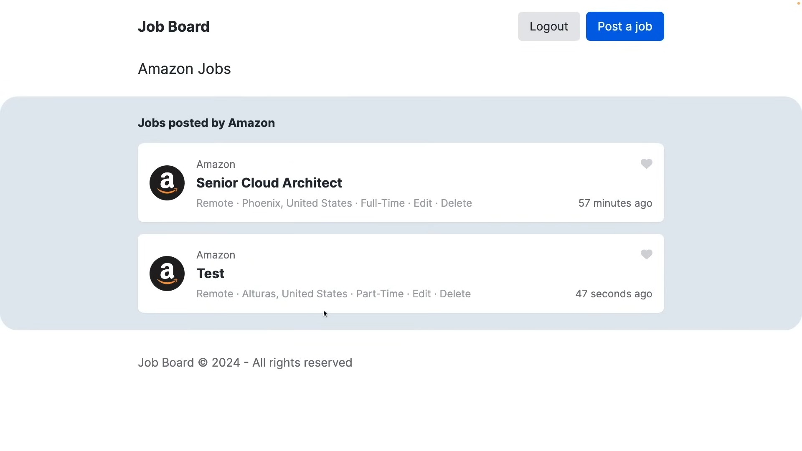

  
  

  
  

  
  

 <!-- Empty space to align with other rows -->

# Introduction

This platform is a robust, dynamic, and responsive job board that simplifies the recruitment process for both job seekers and employers. It enables companies to easily post and manage job listings, while allowing applicants to quickly find relevant opportunities and contact employers directly via email or phone. With features like job search, sorting, and filtering, users can efficiently navigate listings based on their preferences. The platform ensures an intuitive experience, providing employers with real-time control over their job postings, and offering applicants seamless access to job details and communication channels. Built with modern technologies like React, Node.js, MongoDB, and Tailwind CSS, the platform is fully responsive, scalable, and designed for ease of use, making it a powerful solution for job recruitment.

---

## 🚀 **Tech Stack**

  
  
  
  
  

---

## 🌟 **Features**

- **Job Posting**: Employers can create and manage job listings, including job title, description, tags, and contact details.
- **Job Management**: Edit or delete job posts with ease.
- **Job Details Page**: Detailed job views displaying job information, company contacts, and icons.
- **User Authentication**: Secure login system for users to manage their job posts.
- **Contact Employers**: Applicants can reach employers directly via email or phone.
- **Responsive Design**: Fully responsive interface using TailwindCSS to ensure smooth experiences on all screen sizes.
- **Dynamic Rendering**: Fast page loads with server-side rendering (SSR) via Next.js.

---

## 🔧 **Optimizations**

- **Database Indexing**: Optimized MongoDB queries using indexing to fetch job posts and user data quickly.
- **Server-Side Rendering (SSR)**: Leveraged SSR with Next.js to improve performance, reducing page load times.
- **Code Splitting**: Applied dynamic imports in Next.js to minimize the initial bundle size and speed up page loading.
- **Responsive UI**: Utilized TailwindCSS’s utility-first design principles to create a mobile-first, responsive layout.

---

## 📚 **Lessons Learned**

- **Authentication Flow**: Handling secure user authentication and session persistence across pages proved challenging, but was resolved by careful session management.
- **Schema Design**: Structuring MongoDB collections for scalable, efficient querying of job posts and user data was essential for long-term project growth.
- **Error Handling**: Implemented robust error handling to ensure smooth user experience during job posting and editing processes.
- **Responsive Challenges**: Overcame challenges in ensuring the UI was consistent across devices with TailwindCSS's powerful utilities.

---

## 💡 **Future Enhancements**

- **Search and Filter Functionality**: Add powerful search and filter options for job seekers to find relevant job listings.
- **User Profile Pages**: Implement user profiles with the ability to track applied jobs and manage preferences.
- **Real-time Updates**: Integrate real-time job updates and notifications for job applicants and employers.
- **Advanced Analytics**: Add analytics for employers to track job post performance and applicant engagement.

